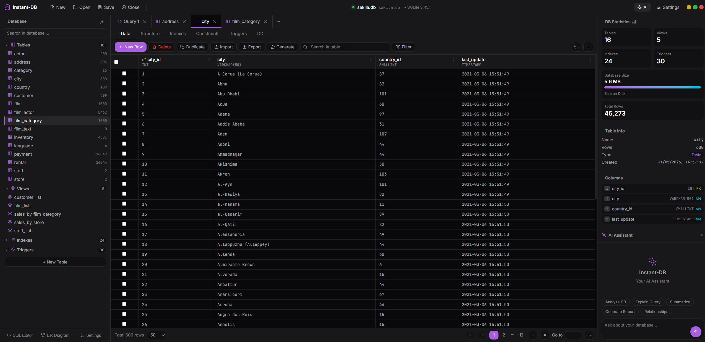
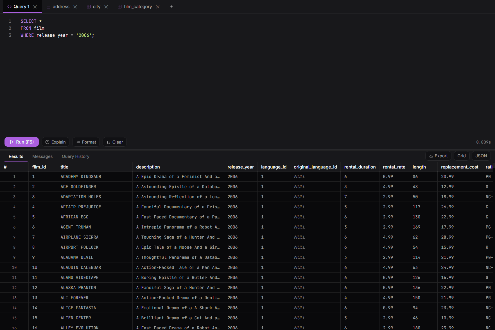
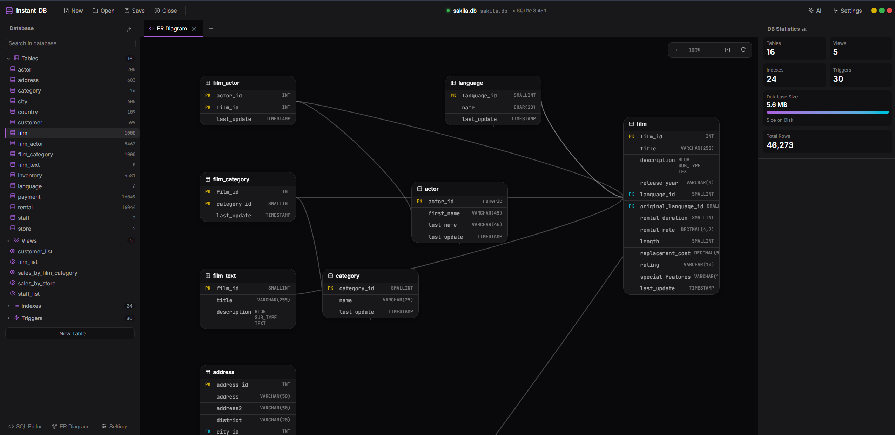

# 🚀 Instant-DB

> **Ultra-fast single-file database viewer, editor, analytics workspace, and AI-powered database assistant.**

[](https://opensource.org/licenses/MIT)
[](https://github.com/CodewithMubasher/Instant-DB)
[](https://github.com/CodewithMubasher/Instant-DB)

---

## ⚡ Quick Start

```
✅ No installation
✅ No setup
✅ No signup
✅ No subscriptions
```

**Just open the HTML file and start working instantly.**

[🎯 Try Live Demo](#demo) | [📖 Documentation](#features) | [🤝 Contribute](#contributing)

---

## 🎨 Why Choose Instant-DB?

Existing database tools felt **outdated**, **heavy**, **overwhelming**, and **locked behind paywalls**.

Instant-DB is different:
- ⚡ **Lightning Fast** - Handles 1M+ rows smoothly
- 🎨 **Beautiful Design** - Modern shadcn-inspired UI
- 🧠 **AI-Powered** - Optional AI assistant (bring your own API key)
- 🎯 **Single File** - No dependencies, no build process
- 🔓 **Completely Open Source** - Full transparency

---

## ✨ Features at a Glance

### 🎯 Core Capabilities
- **⚡ Blazing Fast Performance** - Tested with 1,000,000+ rows using virtual scrolling
- **🗄️ Full Database Management** - Create, read, update, delete with ease
- **✏️ Inline Editing** - Edit data directly with undo/redo support
- **🔍 Global Search** - Find anything instantly across your data

### 🎨 Advanced Tools
- **📊 Data Analytics** - Profiling, statistics, and insights
- **🗺️ Interactive ER Diagrams** - Visualize relationships between tables
- **💬 SQL Editor** - Write and execute custom queries
- **📈 Query History** - Track and revisit past queries
- **🌙 Dark & Light Themes** - Work comfortably anytime

### 🚀 Smart Features
- **🤖 AI Assistant** - Get database help powered by AI
- **🔐 Secure & Local** - All processing happens in your browser
- **📁 Single HTML File** - Deploy anywhere, no server needed
- **🎯 Filter & Sort** - Powerful filtering capabilities

---

## 📊 Performance Metrics

Instant-DB is built for **real-world large datasets**:

| Metric | Result |
|--------|--------|
| **Max Rows Tested** | 1,000,000+ ✅ |
| **Database Size** | 34.3 MB |
| **Virtual Scrolling** | ✅ Smooth |
| **Inline Editing** | ✅ Responsive |
| **Advanced Filtering** | ✅ Lightning Fast |
| **Query Execution** | ✅ Optimized |

**Stays responsive even with massive datasets** 🔥

---

## 🎬 Demo

### Quick Tour (2 min)
```
1. Open index.html in your browser
2. Load a sample database or upload your own
3. Explore tables with interactive ER diagram
4. Try inline editing with undo/redo
5. Write SQL queries in the editor
6. Get AI insights (optional)
```

### Demo Workflow

#### Step 1: Load Data
- Drag & drop your SQLite database
- Or start with sample data
- Instant preview of tables

#### Step 2: Explore
- View all tables in sidebar
- Click to preview data
- See relationships in ER diagram

#### Step 3: Analyze
- Use data profiling tools
- Create filters and sorts
- Export insights

#### Step 4: Edit (Optional)
- Click any cell to edit inline
- Undo/redo changes instantly
- See live validation

#### Step 5: Query (Advanced)
- Write SQL queries
- Execute and view results
- Save favorite queries

---

## 📸 Screenshots

### Main Dashboard

*Intuitive workspace with live data preview*

### Table View with Analytics

*Real-time data profiling and statistics*

### SQL Editor

*Powerful query editor with syntax highlighting*

### Interactive ER Diagram

*Visualize database relationships at a glance*

---

## 🚀 Getting Started

### Method 1: Direct (Recommended)
1. [Download](https://github.com/CodewithMubasher/Instant-DB/releases) `index.html`
2. Double-click to open in your browser
3. Start working with your databases

### Method 2: Clone Repository
```bash
git clone https://github.com/CodewithMubasher/Instant-DB.git
cd Instant-DB
open index.html
```

### Method 3: Online Access
- No download needed
- Works on any device
- No installation required

---

## 🎯 Use Cases

| Use Case | Why Instant-DB |
|----------|----------------|
| 📊 **Data Analysis** | Fast filtering and profiling |
| 🔍 **Database Exploration** | ER diagrams and visual navigation |
| ✏️ **Quick Edits** | Inline editing with undo/redo |
| 🧠 **Learning** | Open source, understand the code |
| 📱 **Remote Access** | Any browser, any device |
| 🚀 **Prototyping** | No setup, just open and go |

---

## 🛠️ Technology Stack

- **Frontend**: Vanilla JavaScript (no framework bloat)
- **Database**: SQLite (via sql.js)
- **Design**: Modern CSS with oklch color system
- **UI Components**: shadcn-inspired design system
- **Fonts**: Inter + JetBrains Mono

---

## 🔐 Security & Privacy

✅ **100% Browser-Based** - No server uploads  
✅ **No Data Collection** - Complete privacy  
✅ **Bring Your Own Keys** - For optional AI features  
✅ **Open Source** - Audit the code yourself  

---

## 🎓 How to Use AI Features

Instant-DB includes an optional AI assistant. To enable:

1. Get an API key from your preferred AI provider
2. Enter it in the settings (uses locally, never saved)
3. Get instant database insights and suggestions

---

## 📚 Documentation

### Common Questions

**Q: Is my data safe?**  
A: Yes! Everything runs in your browser. No data leaves your device.

**Q: What databases can I use?**  
A: Any SQLite database (.db, .sqlite, .sqlite3 files).

**Q: Can I edit data?**  
A: Yes! Inline editing with full undo/redo support.

**Q: Does it work offline?**  
A: Yes! Works completely offline (except optional AI features).

---

## 🤝 Contributing

We love contributions! Whether it's:
- 🐛 Bug reports
- 💡 Feature suggestions
- 🎨 Design improvements
- 📝 Documentation
- 🔧 Code contributions

See [CONTRIBUTING.md](CONTRIBUTING.md) for guidelines.

### Development

```bash
# Clone the repo
git clone https://github.com/CodewithMubasher/Instant-DB.git

# Open in development mode
open index.html

# Make changes and test
# No build process needed!
```

---

## 📄 License

MIT License - See [LICENSE](LICENSE) file for details.

You're free to use, modify, and distribute Instant-DB.

---

## 🙏 Acknowledgments

- 🎨 Design inspired by [shadcn/ui](https://ui.shadcn.com/)
- 🗄️ Database powered by [sql.js](https://sql.js.org/)
- 💫 Community suggestions and feedback

---

## 🔗 Links

- 🌟 [Star on GitHub](https://github.com/CodewithMubasher/Instant-DB)
- 🐛 [Report Issues](https://github.com/CodewithMubasher/Instant-DB/issues)
- 💬 [Discussions](https://github.com/CodewithMubasher/Instant-DB/discussions)
- 👤 [Author](https://github.com/CodewithMubasher)

---

<div align="center">

### Made with ❤️ by [CodewithMubasher](https://github.com/CodewithMubasher)

**Give us a ⭐ if you find Instant-DB useful!**

</div>
